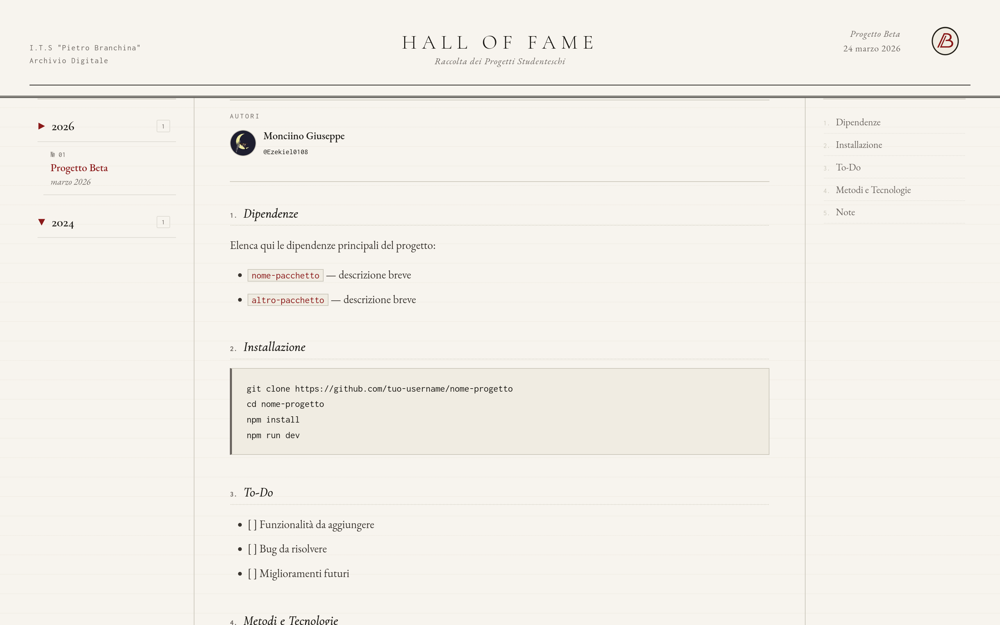

# Hall of Fame

## Showcase:




### What is this for?

This project was realized by students for students and it aims at showcasing the best projects made in the ITS "Pietro Branchina" highschool of Adrano.

#### MIT License

##### Dependencies

- `docker` — [Docker](https://github.com/docker) is a platform that allows developers to build, deploy, and run applications in  containers.

##### Installation

```bash
git clone https://github.com/Branchina-Devs/Hall-of-Fame-Branchina
cd Hall-of-Fame-Branchina
docker compose up -d
```

##### To-Do

- [ ] Add in sorting by field of study
- [ ] Add interface for easy insertion into database

##### Methods and Tecnologies

Docker was used in order to containerize the whole website; npm and typescript where used all throught the backend and html, css and js for the frontend; the database uses mariadb in order to function.

##### Notes

Still awaiting testing and refinements.
